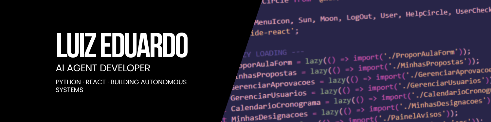

📍 Maceió, Alagoas | 🧠 **Inteligência Artificial** • **Agentes** • **React**

---

## 🚀 Sobre Mim: Da Bancada ao Código, Focado em Inteligência Artificial

Sou um profissional em **transição de carreira** com uma base sólida de **mais de 7 anos de experiência** como **Auxiliar Técnico de Laboratório de Anatomia** no CESMAC. Essa jornada me equipou com habilidades cruciais em **organização, gestão de recursos e, acima de tudo, identificação de problemas reais** no ambiente de trabalho.

Minha paixão por tecnologia me levou a migrar para o desenvolvimento, mas com um foco claro: **utilizar a Inteligência Artificial para criar soluções que transformam realidades**. Não busco apenas escrever código; busco desenvolver **Agentes Inteligentes** que possam otimizar processos, gerar insights e melhorar significativamente a vida de **pessoas e empresas**.

O **Cronograma Lab** é a prova viva dessa filosofia. O que começou como uma necessidade de gestão de laboratórios evoluiu para uma **plataforma de Business Intelligence com IA**, demonstrando minha capacidade de unir experiência prática com o poder da tecnologia para resolver desafios complexos.

### 💡 Minha Jornada e Foco em IA

- 🔬 **7+ anos** de experiência operacional, a base para entender problemas humanos e de gestão.
- 🧠 **Transição para Tech:** Desenvolvedor focado na **criação de agentes e aplicações com IA aplicada**.
- 💻 **Stack Principal:** React, JavaScript, Python e APIs de LLMs (Groq, OpenAI).
- 🎯 **Missão:** Desenvolver **soluções inteligentes e autônomas** que geram impacto real e escalável.
- 🌱 **Atualmente:** Criando aplicações que resolvem problemas reais do mundo acadêmico e explorando novos domínios de agentes.

---

## 🎯 O Que Me Diferencia: A Visão do Desenvolvedor de Agentes

Minha trajetória me proporciona uma perspectiva única, essencial para o desenvolvimento de sistemas inteligentes. Não sou apenas um desenvolvedor que implementa APIs de IA — sou alguém que **viveu os problemas** e entende como um **Agente** deve se comportar para ser verdadeiramente útil.

Essa experiência me permite:

| Foco Atual (Desenvolvimento de Agentes) | Habilidade Adquirida (Experiência Operacional) |
| :--- | :--- |
| ✅ **Design de Agentes Centrado no Usuário:** Criar agentes que resolvem o problema exato, sem complexidade desnecessária. | **Entender profundamente** as necessidades dos usuários finais e o fluxo de trabalho real. |
| ✅ **Criação de Soluções Autônomas:** Desenvolver sistemas que tomam decisões e agem com base em dados e contexto. | **Criar soluções práticas** baseadas em desafios reais e **priorizar usabilidade** no dia a dia. |
| ✅ **Comunicação e Explicação de IA:** Traduzir a complexidade da IA para stakeholders técnicos e não-técnicos. | **Comunicar efetivamente** com diferentes públicos e **pensar em escalabilidade** a partir de experiências operacionais. |
| ✅ **Análise de Impacto e Otimização:** Medir o sucesso do agente pela melhoria de métricas de negócio ou qualidade de vida. | **Gestão de recursos** e foco em otimização de processos e tempo. |

---

## 🛠️ Tecnologias & Ferramentas

### Inteligência Artificial & Backend (Foco Principal)

### Front-end (Base de Desenvolvimento)

### Ferramentas & Plataformas

---

## 🌟 Projeto em Destaque: A Força da IA na Gestão

### 🧪 [Cronograma Lab - Sistema Inteligente de Gestão Acadêmica](https://github.com/luizedu0494/cronograma-lab-frontend)

> **"Transformando uma demanda real em uma solução eficiente e escalável com o poder da Inteligência Artificial."**

Este projeto é o meu manifesto sobre o futuro do desenvolvimento: a união da experiência prática com a **Inteligência Artificial**. O Cronograma Lab resolveu desafios diários de agendamento de laboratórios, evoluindo para uma **plataforma de Business Intelligence** que utiliza IA para otimizar a gestão acadêmica.

#### 💡 A Solução que Criei: Agentes em Ação

**Funcionalidades de Agente Inteligente:**
- 🤖 **Assistente IA (Llama 3.3):** Atua como um agente de análise, fornecendo *insights instantâneos* sobre dados de ocupação e sugerindo otimizações.
- 📈 **Análise Preditiva:** Um agente de otimização que prevê ociosidade e sugere realocação de recursos, maximizando o uso dos laboratórios.
- ✅ **Verificação Automática de Conflitos:** Um agente de validação que impede erros de agendamento em tempo real.
- 🔔 **Notificações via Telegram:** Um agente de comunicação que mantém todos os stakeholders informados instantaneamente.

**Tech Stack:**
- **Front-end:** React • Material-UI • Context API • Chart.js
- **Backend:** Firebase (Firestore, Auth, Hosting)
- **IA:** Groq API (Llama 3.3 70b Versatile)
- **Integrações:** Telegram Bot API • Google Calendar

#### 📈 Impacto Real
- ⚡ **Redução de 80%** no tempo de agendamento.
- 🎯 **Zero conflitos** desde a implementação.
- 📊 **Dados estratégicos** para decisões de gestão.
- 🏆 **Adoção completa** pela coordenação dos laboratórios CESMAC.

---

## 💼 Experiência Profissional

### 🏥 Auxiliar Técnico de Laboratório de Anatomia
**CESMAC - Centro Universitário** | *2017 - Presente* | Maceió, AL

**Responsabilidades:**
- 🔬 Preparação e manutenção de materiais anatômicos para aulas práticas
- 📚 Suporte direto a professores e coordenação acadêmica
- 🗂️ Gestão de recursos e organização de laboratórios
- 👥 Atendimento e orientação a alunos durante práticas laboratoriais
- 📊 Controle de agendamentos e otimização de uso dos espaços
- 🔧 Resolução de problemas operacionais e logísticos

**Conquistas:**
- ✅ Desenvolvimento do **Cronograma Lab**, um sistema inteligente que revolucionou a gestão de laboratórios.
- ✅ Implementação de processos mais eficientes de organização e controle.
- ✅ Ponte entre necessidades acadêmicas e **soluções tecnológicas com IA**.
- ✅ Reconhecimento pela coordenação por iniciativas de melhoria contínua.

---

## 🎯 Objetivos e Próximos Passos: Foco Total em Agentes e IA

### 2026 - Ano de Expansão e Consolidação em IA

#### 💼 Carreira & Desenvolvimento Profissional
- 🚀 **Atuar como Desenvolvedor de Agentes Inteligentes** em projetos desafiadores.
- 🏢 **Integrar equipes de produto** onde possa aplicar minha visão de UX e experiência real de usuário na **criação de soluções autônomas**.
- 📢 **Compartilhar conhecimento** através de artigos técnicos e talks sobre **IA aplicada e desenvolvimento de agentes**.

#### 🛠️ Stack Técnico
- ⚡ **Dominar Python e frameworks de Agentes** (ex: LangChain, CrewAI) para orquestração de LLMs.
- 🔥 **Aprofundar em Machine Learning** para análise preditiva e classificação de dados.
- 🧪 **Implementar testes** (Jest, React Testing Library) em todos os projetos.
- 🎨 **Aprofundar em Design Systems** e componentização avançada.
- 📱 **Explorar React Native** para desenvolvimento mobile, integrando agentes em interfaces móveis.

#### 🌟 Projetos & Impacto
- 🏥 **Cronograma Lab 2.0:** Expandir o agente de otimização para outras instituições de ensino.
- 🤖 **IA Aplicada:** Desenvolver novos **Agentes de Negócio** que resolvam problemas em diferentes setores (empresas, saúde, educação).
- 🌐 **Novo SaaS Educacional:** Criar uma plataforma de gestão acadêmica escalável, **nativa em IA**.
- 🔓 **Open Source:** Contribuir ativamente em projetos da comunidade de IA/Agentes.
- 📊 **Portfolio Técnico:** Publicar 3-5 projetos completos e bem documentados, **focados em IA**.

### 🔮 Visão de Longo Prazo (2027+)

Meu objetivo é me tornar referência em **desenvolvimento de soluções inteligentes e autônomas** no Brasil, combinando expertise técnica com profundo entendimento das necessidades do setor acadêmico e empresarial. Quero liderar projetos que **democratizem o acesso a agentes de IA** para otimizar a gestão e a qualidade de vida.

Acredito que minha jornada única — **da bancada do laboratório ao código com IA** — me posiciona para criar produtos que realmente fazem sentido para quem os usa. Tecnologia não é sobre ferramentas, é sobre **transformar realidades através da inteligência aplicada**.

---

## 💬 Vamos Conversar?

Estou sempre aberto a **novas oportunidades**, **colaborações** e **conversas sobre Inteligência Artificial e Agentes**! 

Se você:
- 🏢 Busca um desenvolvedor com **visão de produto** e experiência real de usuário, **focado em IA e Agentes**.
- 🤝 Quer colaborar em projetos que **resolvem problemas reais** usando o poder da inteligência artificial.
- 💡 Tem ideias para **soluções autônomas** que podem melhorar a vida de pessoas e empresas.
- 🎓 Trabalha com **tecnologia no contexto acadêmico** ou **desenvolvimento de agentes**.
- 💻 Quer trocar experiências sobre **React, UX/UI** ou **transição de carreira para IA**.

**Não hesite em entrar em contato!**

---

  
### ⭐ "A tecnologia é melhor quando aproxima as pessoas." - Matt Mullenweg

### 💡 "Não basta resolver problemas técnicos. É preciso entender os problemas humanos por trás deles. A Inteligência Artificial é a ferramenta para resolver ambos."

---

## 📊 Estatísticas do GitHub

  

---

## 📈 Atividade de Contribuição

